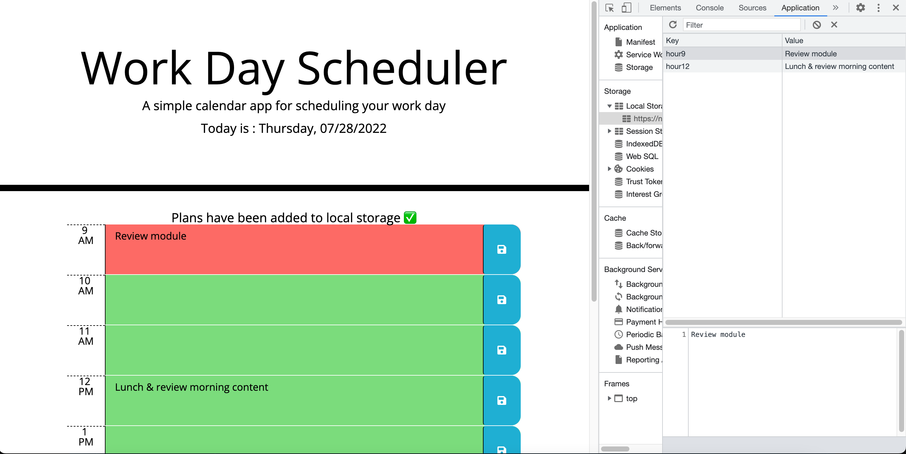

# workday-planner
## Mock Up

## Objective
I am creating a work day (9-5) planner to help users stay organized! 

USERS will be presented with the current day & date within the header
USERS will be presented with the hours 9AM - 5AM 
USERS will see previous hours from the current hour with the background color of gray
USERS will see the current hour with a background color of green
USERS will see hours ahead of the current hour with a background color of red
USERS can click in any of the textareas and type their plans out
ONCE users have finished typing their plans, they can save their options with the button to the right of every textarea
ONCE users click save, they will be prompted that their plans have been saved in local storage 
USERS can refresh the page and still see their plans on the page
IF the user leaves the textarea blank and attempts to save, they will be prompted with an alert

## Description
What was your motivation?

My motivation was to create a day planner to help users stay organized! I also needed to practice my jQuery skills to help sharpen my skills. As a beginner, building projects are vital for growth. 
I plan to build and learn more to one day become a developer! 

Why did you build this project?

I built this project to have my own project to help myself understand local storage and become more proficient with functions. The mindset for this project was a lot better than my most recent one, I wouldn't have learned that without the experience. Build, build, build. It's the best way to learn! 

What did you learn? 

This project I learned a lot, your approach is SO IMPORTANT to any coding challenge, assignment, task that might come your way. The more you are able to break down and understand what you are building, de-bugging, no matter what it is. Break it down and fully understand what you're being asked of when you approach the challenge. Read the README 2, 3, 4, maybe even 5 times! The learning experience in my coding journey thus far is going great, already so many ups and downs and the journey is just beginning! This is something I will remember to implement into all things code going forward!

## Deployed Page

https://natesoum.github.io/workday-planner/

## Resources

https://api.jquery.com/
https://getbootstrap.com/docs/4.3/getting-started/introduction/
https://developer.mozilla.org/en-US/docs/Web/API/Window/localStorage